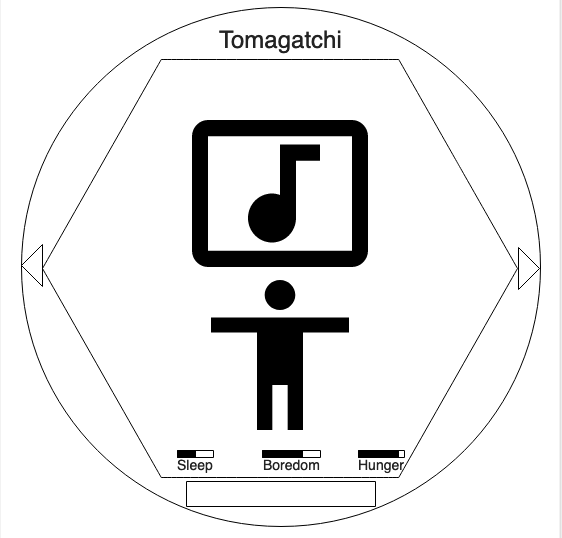

# Project.0-Tomagatchi
First SEI 9-8 Project

# Description
The goal of the game is to raise a digimon from an egg to a champion level digimon, without letting it die along the way.

# WireFrame

# User Stories
The user will use the buttons to keep the tomagatchi alive.

The tomagatchi will have his needs rising and die at a certain level.

The tomagatchi will have multiple rooms to move between in order to satisfy their needs.

# Personal Experience
As my first time building a webpage from the ground up, the tamagotchi project was a challenge to find the best starting point for a game. I decided to start with the css, because it felt like the part of the project I would struggle with the most. The app turned into an in browser console, with buttons that did multiple things. and a dynamic layout that would work on most screen sizes.
